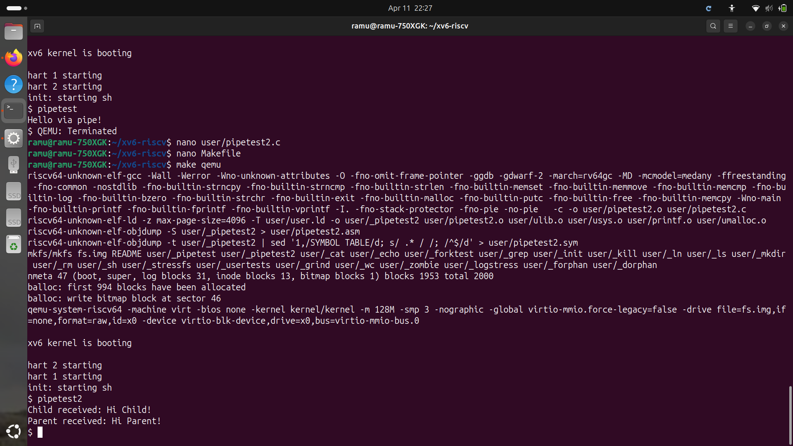
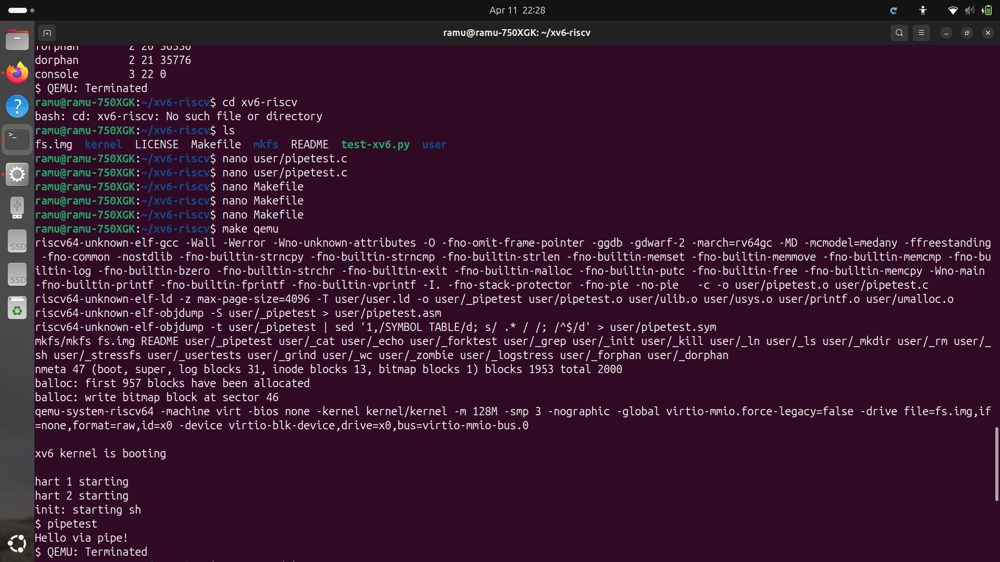
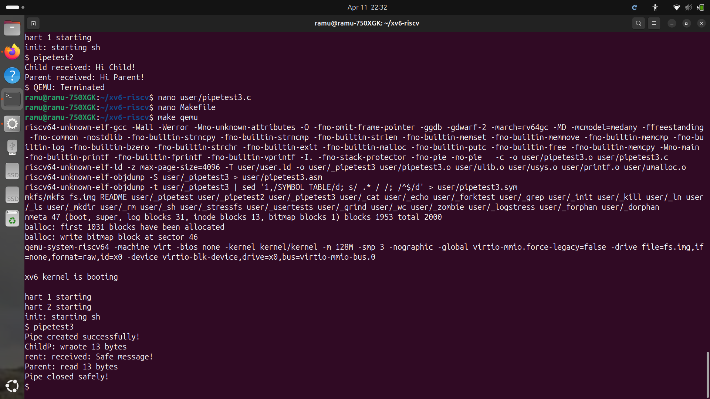

# Project 1: xv6 Custom System Calls
## Student Name: Ramu
## Topic: Inter-Process Communication (IPC) using Pipes

---

## What is a Pipe?
A pipe is a system call that allows two processes to 
communicate with each other. One process writes data 
into the pipe and another process reads from it.

---

## Files Added
1. user/pipetest.c  - Basic pipe communication
2. user/pipetest2.c - Bidirectional pipe
3. user/pipetest3.c - Pipe with error handling

---

## Program 1: Basic Pipe (pipetest.c)
### What it does:
- Creates a pipe between parent and child process
- Child writes "Hello via pipe!" to pipe
- Parent reads and prints the message

### How to run:
$ pipetest

### Output:
Hello via pipe!

---

## Program 2: Bidirectional Pipe (pipetest2.c)
### What it does:
- Creates TWO pipes for two-way communication
- Parent sends message to child
- Child sends message back to parent
- Both processes communicate with each other

### How to run:
$ pipetest2

### Output:
Child received: Hi Child!
Parent received: Hi Parent!

---

## Program 3: Pipe with Error Handling (pipetest3.c)
### What it does:
- Creates pipe with proper error checking
- Checks if pipe creation succeeds
- Checks if fork succeeds  
- Checks if read/write succeeds
- Reports number of bytes transferred
- Closes pipe safely

### How to run:
$ pipetest3

### Output:
Pipe created successfully!
Child: wrote 13 bytes
Parent: received: Safe message!
Parent: read 13 bytes
Pipe closed safely!

---

## How Pipes Work in xv6
1. pipe(fd) creates two file descriptors
   - fd[0] = read end
   - fd[1] = write end
2. fork() creates child process
3. Child writes to fd[1]
4. Parent reads from fd[0]
5. close() closes unused ends

---

## Screenshots

### Basic Pipe Output:

### Bidirectional Pipe Output:

### Error Handling Pipe Output:

---

## Conclusion
Successfully implemented 3 pipe functionalities
in xv6 operating system demonstrating IPC using
pipes including basic, bidirectional and 
error-handled pipe communication.
